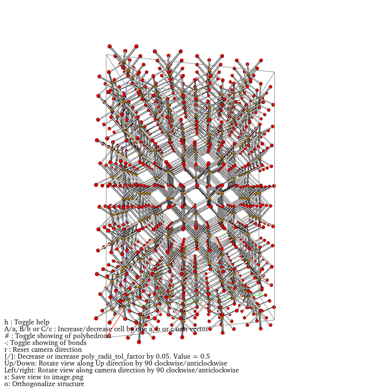

## Usando COD Crystallography Open Database



Usando la base de datos de COD obtendremos los datos mínimos para contruir el sistema ***lattice*** y construir el cristal: $$Fe_2 O_3$$

Código: 9015964

- a = 5.09
- b = 5.09
- c = 13.77
- alpha (y-z) = 90ºº
- beta (x-z) = 90º
- gamma (x-y) = 120º
- Cristal = 30 átomos (lo mínimo para formar la estructura cristalina)
- Densidad = 5,14 g/cm3
- Posición Wykoff de Fe: 12c, x=1/3, y=2/3; z=0.521489
- Posición Wykoff de O: 18e, x=0.694599; y=x; z=3/4
- Volume = 309.29 ų

Si no teneis ninguno de las bibliotecas instaladas quitand el comentario # que hay al prinicipio.


```python
# Instalar paquetes en caso de no tenerlos
#!pip install pymatgen  # Incluye MPRester, Element, Composition, Lattice, Structure, Molecule, SpacegroupAnalyzer, COD, StructureVis
#!pip install numpy
#!pip install matplotlib
#!pip install pandas
#!pip install nglview
#!pip install ase  # Para instalar ASE (Atomic Simulation Environment)
#!pip install vtk  # Para StructureVis (necesita vtk para visualizaciones)
```


```python
# Carga de paquetes
from pymatgen.ext.matproj import MPRester
from pymatgen.core import Element, Composition, Lattice, Structure, Molecule
from pymatgen.symmetry.analyzer import SpacegroupAnalyzer
import numpy as np
import matplotlib.pyplot as plt
import pandas as pd

api_key = "Vuestro Código"
mpr = MPRester(api_key)
```

Debéis generar vuestra api key registrandose en https://legacy.materialsproject.org/janrain/loginpage/?next=/open y añadirla en ****api_key**** de la celda de arriba.


```python
from pymatgen.ext.cod import COD

cod = COD()
```


```python
fe2o3 = cod.get_structure_by_id(9015964) # nombre que le asignamos a la estructura
print(fe2o3) # obtenemos los datos de la base de datos según su código id
```

    Full Formula (Fe12 O18)
    Reduced Formula: Fe2O3
    abc   :   5.034600   5.034600  13.747300
    angles:  90.000000  90.000000 120.000000
    pbc   :       True       True       True
    Sites (30)
      #  SP           a         b         c
    ---  ----  --------  --------  --------
      0  Fe    0         0         0.35534
      1  Fe    0.666667  0.333333  0.688673
      2  Fe    0.333333  0.666667  0.022007
      3  Fe    0         0         0.85534
      4  Fe    0.666667  0.333333  0.188673
      5  Fe    0.333333  0.666667  0.522007
      6  Fe    0         0         0.14466
      7  Fe    0.666667  0.333333  0.477993
      8  Fe    0.333333  0.666667  0.811327
      9  Fe    0         0         0.64466
     10  Fe    0.666667  0.333333  0.977993
     11  Fe    0.333333  0.666667  0.311327
     12  O     0.3056    0         0.25
     13  O     0.972267  0.333333  0.583333
     14  O     0.638933  0.666667  0.916667
     15  O     0.3056    0.3056    0.75
     16  O     0.972267  0.638933  0.083333
     17  O     0.638933  0.972267  0.416667
     18  O     0         0.3056    0.25
     19  O     0.666667  0.638933  0.583333
     20  O     0.333333  0.972267  0.916667
     21  O     0.6944    0         0.75
     22  O     0.361067  0.333333  0.083333
     23  O     0.027733  0.666667  0.416667
     24  O     0.6944    0.6944    0.25
     25  O     0.361067  0.027733  0.583333
     26  O     0.027733  0.361067  0.916667
     27  O     0         0.6944    0.75
     28  O     0.666667  0.027733  0.083333
     29  O     0.333333  0.361067  0.416667
    

Obtenemos las coordenadas fraccionarias de la celda unidad del cristal Fe2O3. Duplicaremos la celda por dos en cada eje para tener un mayor crista.


```python
replicas = [2, 2, 2]
structure = fe2o3 * replicas
print(structure)
```

    Full Formula (Fe96 O144)
    Reduced Formula: Fe2O3
    abc   :  10.069200  10.069200  27.494600
    angles:  90.000000  90.000000 120.000000
    pbc   :       True       True       True
    Sites (240)
      #  SP           a         b         c
    ---  ----  --------  --------  --------
      0  Fe    0         0         0.17767
      1  Fe    0         0         0.67767
      2  Fe    1         0.5       0.17767
      3  Fe    1         0.5       0.67767
      4  Fe    0.5       0         0.17767
      5  Fe    0.5       0         0.67767
      6  Fe    0.5       0.5       0.17767
      7  Fe    0.5       0.5       0.67767
      8  Fe    0.333333  0.166667  0.344337
      9  Fe    0.333333  0.166667  0.844337
     10  Fe    0.333333  0.666667  0.344337
     11  Fe    0.333333  0.666667  0.844337
     12  Fe    0.833333  0.166667  0.344337
     13  Fe    0.833333  0.166667  0.844337
     14  Fe    0.833333  0.666667  0.344337
     15  Fe    0.833333  0.666667  0.844337
     16  Fe    0.166667  0.333333  0.011003
     17  Fe    0.166667  0.333333  0.511003
     18  Fe    0.166667  0.833333  0.011003
     19  Fe    0.166667  0.833333  0.511003
     20  Fe    0.666667  0.333333  0.011003
     21  Fe    0.666667  0.333333  0.511003
     22  Fe    0.666667  0.833333  0.011003
     23  Fe    0.666667  0.833333  0.511003
     24  Fe    0         0         0.42767
     25  Fe    0         0         0.92767
     26  Fe    1         0.5       0.42767
     27  Fe    1         0.5       0.92767
     28  Fe    0.5       0         0.42767
     29  Fe    0.5       0         0.92767
     30  Fe    0.5       0.5       0.42767
     31  Fe    0.5       0.5       0.92767
     32  Fe    0.333333  0.166667  0.094337
     33  Fe    0.333333  0.166667  0.594337
     34  Fe    0.333333  0.666667  0.094337
     35  Fe    0.333333  0.666667  0.594337
     36  Fe    0.833333  0.166667  0.094337
     37  Fe    0.833333  0.166667  0.594337
     38  Fe    0.833333  0.666667  0.094337
     39  Fe    0.833333  0.666667  0.594337
     40  Fe    0.166667  0.333333  0.261003
     41  Fe    0.166667  0.333333  0.761003
     42  Fe    0.166667  0.833333  0.261003
     43  Fe    0.166667  0.833333  0.761003
     44  Fe    0.666667  0.333333  0.261003
     45  Fe    0.666667  0.333333  0.761003
     46  Fe    0.666667  0.833333  0.261003
     47  Fe    0.666667  0.833333  0.761003
     48  Fe    0         0         0.07233
     49  Fe    0         0         0.57233
     50  Fe    1         0.5       0.07233
     51  Fe    1         0.5       0.57233
     52  Fe    0.5       0         0.07233
     53  Fe    0.5       0         0.57233
     54  Fe    0.5       0.5       0.07233
     55  Fe    0.5       0.5       0.57233
     56  Fe    0.333333  0.166667  0.238997
     57  Fe    0.333333  0.166667  0.738997
     58  Fe    0.333333  0.666667  0.238997
     59  Fe    0.333333  0.666667  0.738997
     60  Fe    0.833333  0.166667  0.238997
     61  Fe    0.833333  0.166667  0.738997
     62  Fe    0.833333  0.666667  0.238997
     63  Fe    0.833333  0.666667  0.738997
     64  Fe    0.166667  0.333333  0.405663
     65  Fe    0.166667  0.333333  0.905663
     66  Fe    0.166667  0.833333  0.405663
     67  Fe    0.166667  0.833333  0.905663
     68  Fe    0.666667  0.333333  0.405663
     69  Fe    0.666667  0.333333  0.905663
     70  Fe    0.666667  0.833333  0.405663
     71  Fe    0.666667  0.833333  0.905663
     72  Fe    0         0         0.32233
     73  Fe    0         0         0.82233
     74  Fe    1         0.5       0.32233
     75  Fe    1         0.5       0.82233
     76  Fe    0.5       0         0.32233
     77  Fe    0.5       0         0.82233
     78  Fe    0.5       0.5       0.32233
     79  Fe    0.5       0.5       0.82233
     80  Fe    0.333333  0.166667  0.488997
     81  Fe    0.333333  0.166667  0.988997
     82  Fe    0.333333  0.666667  0.488997
     83  Fe    0.333333  0.666667  0.988997
     84  Fe    0.833333  0.166667  0.488997
     85  Fe    0.833333  0.166667  0.988997
     86  Fe    0.833333  0.666667  0.488997
     87  Fe    0.833333  0.666667  0.988997
     88  Fe    0.166667  0.333333  0.155663
     89  Fe    0.166667  0.333333  0.655663
     90  Fe    0.166667  0.833333  0.155663
     91  Fe    0.166667  0.833333  0.655663
     92  Fe    0.666667  0.333333  0.155663
     93  Fe    0.666667  0.333333  0.655663
     94  Fe    0.666667  0.833333  0.155663
     95  Fe    0.666667  0.833333  0.655663
     96  O     0.1528    0         0.125
     97  O     0.1528    0         0.625
     98  O     0.1528    0.5       0.125
     99  O     0.1528    0.5       0.625
    100  O     0.6528    0         0.125
    101  O     0.6528    0         0.625
    102  O     0.6528    0.5       0.125
    103  O     0.6528    0.5       0.625
    104  O     0.486133  0.166667  0.291667
    105  O     0.486133  0.166667  0.791667
    106  O     0.486133  0.666667  0.291667
    107  O     0.486133  0.666667  0.791667
    108  O     0.986133  0.166667  0.291667
    109  O     0.986133  0.166667  0.791667
    110  O     0.986133  0.666667  0.291667
    111  O     0.986133  0.666667  0.791667
    112  O     0.319467  0.333333  0.458333
    113  O     0.319467  0.333333  0.958333
    114  O     0.319467  0.833333  0.458333
    115  O     0.319467  0.833333  0.958333
    116  O     0.819467  0.333333  0.458333
    117  O     0.819467  0.333333  0.958333
    118  O     0.819467  0.833333  0.458333
    119  O     0.819467  0.833333  0.958333
    120  O     0.1528    0.1528    0.375
    121  O     0.1528    0.1528    0.875
    122  O     0.1528    0.6528    0.375
    123  O     0.1528    0.6528    0.875
    124  O     0.6528    0.1528    0.375
    125  O     0.6528    0.1528    0.875
    126  O     0.6528    0.6528    0.375
    127  O     0.6528    0.6528    0.875
    128  O     0.486133  0.319467  0.041667
    129  O     0.486133  0.319467  0.541667
    130  O     0.486133  0.819467  0.041667
    131  O     0.486133  0.819467  0.541667
    132  O     0.986133  0.319467  0.041667
    133  O     0.986133  0.319467  0.541667
    134  O     0.986133  0.819467  0.041667
    135  O     0.986133  0.819467  0.541667
    136  O     0.319467  0.486133  0.208333
    137  O     0.319467  0.486133  0.708333
    138  O     0.319467  0.986133  0.208333
    139  O     0.319467  0.986133  0.708333
    140  O     0.819467  0.486133  0.208333
    141  O     0.819467  0.486133  0.708333
    142  O     0.819467  0.986133  0.208333
    143  O     0.819467  0.986133  0.708333
    144  O     1         0.1528    0.125
    145  O     1         0.1528    0.625
    146  O     1         0.6528    0.125
    147  O     1         0.6528    0.625
    148  O     0.5       0.1528    0.125
    149  O     0.5       0.1528    0.625
    150  O     0.5       0.6528    0.125
    151  O     0.5       0.6528    0.625
    152  O     0.333333  0.319467  0.291667
    153  O     0.333333  0.319467  0.791667
    154  O     0.333333  0.819467  0.291667
    155  O     0.333333  0.819467  0.791667
    156  O     0.833333  0.319467  0.291667
    157  O     0.833333  0.319467  0.791667
    158  O     0.833333  0.819467  0.291667
    159  O     0.833333  0.819467  0.791667
    160  O     0.166667  0.486133  0.458333
    161  O     0.166667  0.486133  0.958333
    162  O     0.166667  0.986133  0.458333
    163  O     0.166667  0.986133  0.958333
    164  O     0.666667  0.486133  0.458333
    165  O     0.666667  0.486133  0.958333
    166  O     0.666667  0.986133  0.458333
    167  O     0.666667  0.986133  0.958333
    168  O     0.3472    0         0.375
    169  O     0.3472    0         0.875
    170  O     0.3472    0.5       0.375
    171  O     0.3472    0.5       0.875
    172  O     0.8472    0         0.375
    173  O     0.8472    0         0.875
    174  O     0.8472    0.5       0.375
    175  O     0.8472    0.5       0.875
    176  O     0.180533  0.166667  0.041667
    177  O     0.180533  0.166667  0.541667
    178  O     0.180533  0.666667  0.041667
    179  O     0.180533  0.666667  0.541667
    180  O     0.680533  0.166667  0.041667
    181  O     0.680533  0.166667  0.541667
    182  O     0.680533  0.666667  0.041667
    183  O     0.680533  0.666667  0.541667
    184  O     0.013867  0.333333  0.208333
    185  O     0.013867  0.333333  0.708333
    186  O     0.013867  0.833333  0.208333
    187  O     0.013867  0.833333  0.708333
    188  O     0.513867  0.333333  0.208333
    189  O     0.513867  0.333333  0.708333
    190  O     0.513867  0.833333  0.208333
    191  O     0.513867  0.833333  0.708333
    192  O     0.3472    0.3472    0.125
    193  O     0.3472    0.3472    0.625
    194  O     0.3472    0.8472    0.125
    195  O     0.3472    0.8472    0.625
    196  O     0.8472    0.3472    0.125
    197  O     0.8472    0.3472    0.625
    198  O     0.8472    0.8472    0.125
    199  O     0.8472    0.8472    0.625
    200  O     0.180533  0.013867  0.291667
    201  O     0.180533  0.013867  0.791667
    202  O     0.180533  0.513867  0.291667
    203  O     0.180533  0.513867  0.791667
    204  O     0.680533  0.013867  0.291667
    205  O     0.680533  0.013867  0.791667
    206  O     0.680533  0.513867  0.291667
    207  O     0.680533  0.513867  0.791667
    208  O     0.013867  0.180533  0.458333
    209  O     0.013867  0.180533  0.958333
    210  O     0.013867  0.680533  0.458333
    211  O     0.013867  0.680533  0.958333
    212  O     0.513867  0.180533  0.458333
    213  O     0.513867  0.180533  0.958333
    214  O     0.513867  0.680533  0.458333
    215  O     0.513867  0.680533  0.958333
    216  O     0         0.3472    0.375
    217  O     0         0.3472    0.875
    218  O     0         0.8472    0.375
    219  O     0         0.8472    0.875
    220  O     0.5       0.3472    0.375
    221  O     0.5       0.3472    0.875
    222  O     0.5       0.8472    0.375
    223  O     0.5       0.8472    0.875
    224  O     0.333333  0.013867  0.041667
    225  O     0.333333  0.013867  0.541667
    226  O     0.333333  0.513867  0.041667
    227  O     0.333333  0.513867  0.541667
    228  O     0.833333  0.013867  0.041667
    229  O     0.833333  0.013867  0.541667
    230  O     0.833333  0.513867  0.041667
    231  O     0.833333  0.513867  0.541667
    232  O     0.166667  0.180533  0.208333
    233  O     0.166667  0.180533  0.708333
    234  O     0.166667  0.680533  0.208333
    235  O     0.166667  0.680533  0.708333
    236  O     0.666667  0.180533  0.208333
    237  O     0.666667  0.180533  0.708333
    238  O     0.666667  0.680533  0.208333
    239  O     0.666667  0.680533  0.708333
    

Visor del cristal con más manipulación:


```python
import nglview as nv

view = nv.show_pymatgen(structure)
view.add_unitcell() 
view.display()
```


    


    NGLWidget()


```python
from pymatgen.vis.structure_vtk import StructureVis

vis = StructureVis()
vis.show_polyhedron = False
vis.set_structure(structure)

vis.show()
```

Finalmente pasaremos las coordenadas de los átomos en un dataframe tanto para formato csv como en excel. El formato dataframe consta de variables tabuladas en columnas y cada fila son sus observaciones.


```python
df = []
for site in structure.sites:
    frac_coords = site.frac_coords
    cart_coord = structure.lattice.get_cartesian_coords(frac_coords)
    df.append(cart_coord)
```


```python
mineral = pd.DataFrame(df, columns=['x', 'y', 'z'])  #cada columna será las coordenadas cartesianas x-y-z.
mineral.to_excel('coord_fe2o3.xlsx')
mineral.to_csv('coord_fe2o3.csv')
# Se guardaran en el la ruta donde ejecutes este código
```


```python
# Vemos que apariencia tiene
mineral.head()
```


<div>
<style scoped>
    .dataframe tbody tr th:only-of-type {
        vertical-align: middle;
    }

    .dataframe tbody tr th {
        vertical-align: top;
    }

    .dataframe thead th {
        text-align: right;
    }
</style>
<table border="1" class="dataframe">
  <thead>
    <tr style="text-align: right;">
      <th></th>
      <th>x</th>
      <th>y</th>
      <th>z</th>
    </tr>
  </thead>
  <tbody>
    <tr>
      <th>0</th>
      <td>0.0000</td>
      <td>0.000000</td>
      <td>4.884966</td>
    </tr>
    <tr>
      <th>1</th>
      <td>0.0000</td>
      <td>0.000000</td>
      <td>18.632266</td>
    </tr>
    <tr>
      <th>2</th>
      <td>7.5519</td>
      <td>4.360091</td>
      <td>4.884966</td>
    </tr>
    <tr>
      <th>3</th>
      <td>7.5519</td>
      <td>4.360091</td>
      <td>18.632266</td>
    </tr>
    <tr>
      <th>4</th>
      <td>5.0346</td>
      <td>0.000000</td>
      <td>4.884966</td>
    </tr>
  </tbody>
</table>
</div>


```python
mineral.tail()
```


<div>
<style scoped>
    .dataframe tbody tr th:only-of-type {
        vertical-align: middle;
    }

    .dataframe tbody tr th {
        vertical-align: top;
    }

    .dataframe thead th {
        text-align: right;
    }
</style>
<table border="1" class="dataframe">
  <thead>
    <tr style="text-align: right;">
      <th></th>
      <th>x</th>
      <th>y</th>
      <th>z</th>
    </tr>
  </thead>
  <tbody>
    <tr>
      <th>235</th>
      <td>-1.748013</td>
      <td>5.934375</td>
      <td>19.475342</td>
    </tr>
    <tr>
      <th>236</th>
      <td>5.803887</td>
      <td>1.574284</td>
      <td>5.728042</td>
    </tr>
    <tr>
      <th>237</th>
      <td>5.803887</td>
      <td>1.574284</td>
      <td>19.475342</td>
    </tr>
    <tr>
      <th>238</th>
      <td>3.286587</td>
      <td>5.934375</td>
      <td>5.728042</td>
    </tr>
    <tr>
      <th>239</th>
      <td>3.286587</td>
      <td>5.934375</td>
      <td>19.475342</td>
    </tr>
  </tbody>
</table>
</div>


Un saludo,

Juan De los Santos

_jmdelosantos17@gmail.com_
